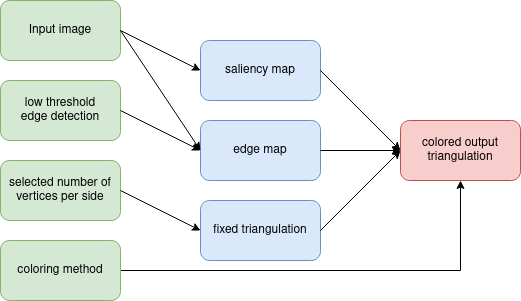
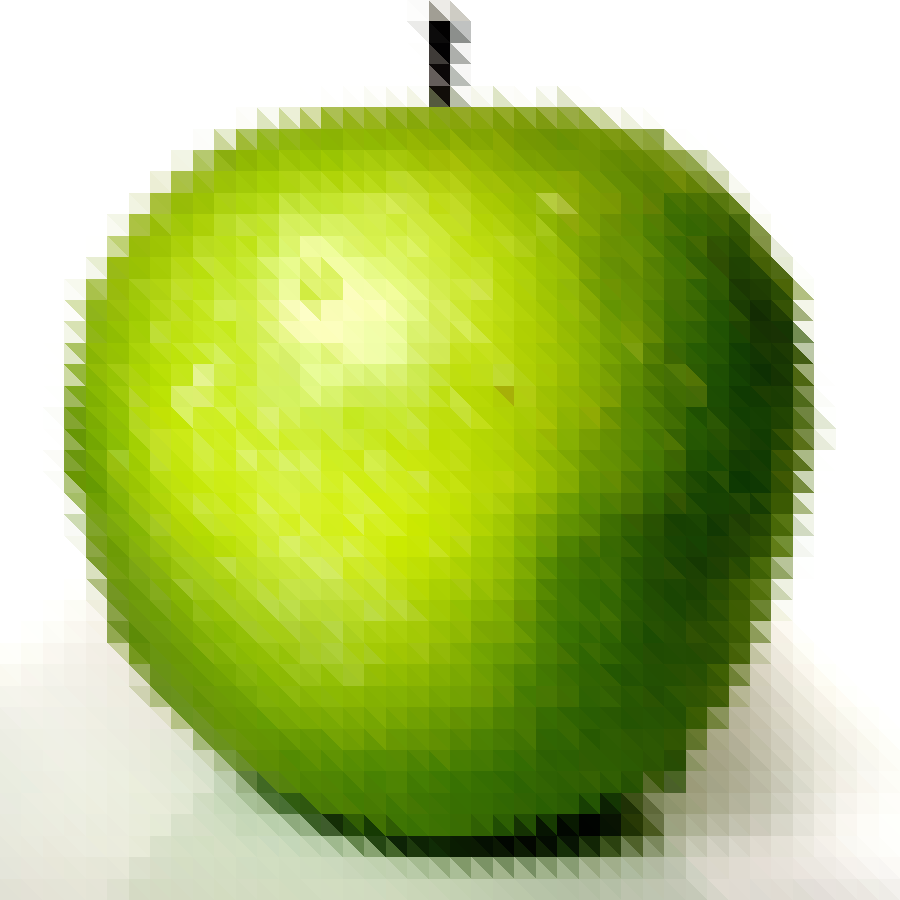

# Research project CSE3000 (triangle coloring methods to approximate 2D images)

## Introduction
Low-poly images are getting more popular, where an image is triangulated and colored mostly with constant colors or sometimes bilinear interpolation. Here different coloring methods will be explored. As this project is more focussed on coloring methods, it will only work with a fixed grid of triangles and a square input images (otherwise the result will be squashed into a square). The program uses the following basic pipeline to produce the images.




## Building and Running
This program has only been tested on archbased linux distributions.

### Prerequisites
Some programs are needed, namely:
* glfw ( ```pacman -S glfw-x11``` or ```pacman -S glfw-wayland``` )
* opencv ( ```pacman -S opencv opencv-samples``` )
* gsl ( ```pacman -S gsl``` )
* glm ( ```pacman -S glm``` )
* freeimage ( ```pacman -S freeimage``` )

### Cloning and Building
To get the project use : ```git clone --recurse-submodules https://github.com/daangoossens22/color_optimization.git```
To build the executable ```make``` can be executed. To clean all buildfiles ```make clean``` can be executed.

### Running
To run the executable, the following command can be run:
```./coloring_methods```

Caution when opening the edge map or the saliency map, as they can only be closed by pressing any key on the keyboad. Closing it by pressing the x button, locks the program.

### Calculating the MSE
There is a python script that can calculate the mean squared error and produces an image, which is the absolute difference between the 2 provided images. To run it, the following command can be executed:
```python3 mse_calc.py {target_image} {produced_image}```

## Provided coloring methods
Here the provided coloring methods are shown on one of the input images. Click on them to see the full image.
|||||||
----|----|----|----|----|----
target image|average color no saliency|average color with saliency|center color|linear split constant color|quadratic split constant color
 |  |  |  |  |  | 
|bilinear interpolation (no opt)|bilinear interpolation (opt)|biquadratic interpolation (opt)|bicubic interpolation (opt)|bicubic interpolation (opt)
 |  |  |  |  | 


## Intermediate steps (needed for some coloring methods)
The saliency map is used by the coloring method; average color with saliency. The edge map is used by the coloring methods; linear split constant color and quadratic split constant color.
||||
----|----|----
target image|saliency map|edge map
 |  | 

## (potential) future work/ideas
* Add more coloring methods
* improve the edge and saliency map
* How does better triangulisation affect the output and how can it be optimised for each coloring method?
* Combine different coloring methods (based on different factors such as the saliency/edge map)
  * for example combining linear split with nonlinear interpolation to get sharp edges on the main subject
* How good nonlinear interpolation functions as compression?
  * How does optimizing the triangulatisation affect the MSE (and how much more data does it take to store)?
  * How does one large (higher degree) Bézier triangle compare against multiple smaller Bézier triangles?
  * Does optimizing each triangle with a different order Bézier triangle depending on the minimum error to the target imagei work well?
  * Does making the control points on the edges and vertices of each triangle shared, affect the final result and how does it affect the time it takes to get a best fit?
